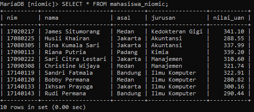
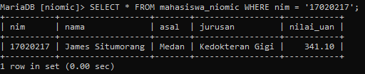
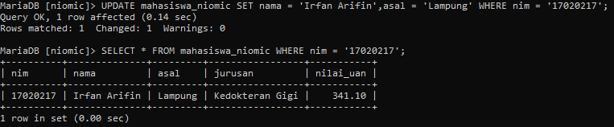
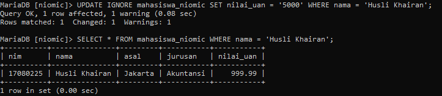
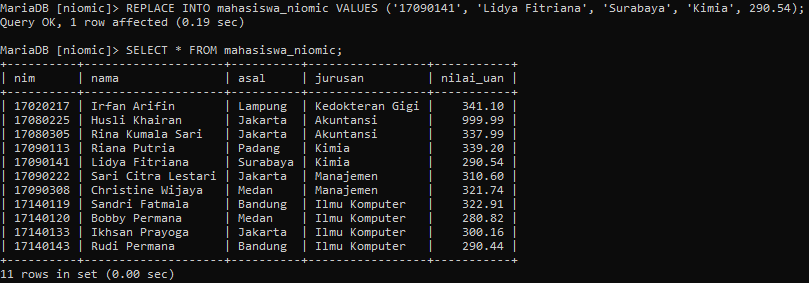

# Tugas_9_MySQL

### 1. Buat database niomic kemudian buat tabel mahasiswa_niomic dengan data sebagai berikut:

### **(Note: Silahkan teman-teman berkreasi untuk tipe data.)**

```mysql
CREATE DATABASE niomic;
```

```mysql
USE niomic;
```

```mysql
CREATE TABLE mahasiswa_niomic (
	nim CHAR(8) PRIMARY KEY,
	nama VARCHAR(50),
	asal VARCHAR(50),
	jurusan VARCHAR (20),
	nilai_uan DEC(5,2)
);
```

```mysql
INSERT INTO mahasiswa_niomic VALUES
('17090113', 'Riana Putria', 'Padang', 'Kimia', 339.20),
('17140143', 'Rudi Permana', 'Bandung', 'Ilmu Komputer', 290.44),
('17090222', 'Sari Citra Lestari', 'Jakarta', 'Manajemen', 310.60),
('17080305', 'Rina Kumala Sari', 'Jakarta', 'Akuntansi', 337.99),
('17020217', 'James Situmorang', 'Medan', 'Kedokteran Gigi', 341.10),
('17140119', 'Sandri Fatmala', 'Bandung', 'Ilmu Komputer', 322.91),
('17080225', 'Husli Khairan', 'Jakarta', 'Akuntansi', 288.55),
('17090308', 'Christine Wijaya','Medan','Manajemen',321.74),
('17140133', 'Ikhsan Prayoga', 'Jakarta', 'Ilmu Komputer', 300.16),
('17140120', 'Bobby Permana', 'Medan', 'Ilmu Komputer', 280.82);
```


### 2. Ubah kolom mahasiswa_niomic dengan nama = Irfan Arifin, asal =  Lampung dengan kondisi nim = '17020217'
### SEBELUM DIUBAH
```mysql
SELECT * FROM mahasiswa_niomic WHERE nim = '17020217';
```


### SETELAH DIUBAH
```mysql
UPDATE mahasiswa_niomic 
SET 
nama = 'Irfan Arifin',
asal = 'Lampung' 
WHERE nim = '17020217';
```

```mysql
SELECT * FROM mahasiswa_niomic WHERE nim = '17020217';
```


### 3. Ubah kolom nilai_uan = 5000 atas nama Husli Khairan. **(Note: Gunakan perintah update ignore)**
```mysql
UPDATE IGNORE mahasiswa_niomic SET nilai_uan = '5000' 
WHERE nama = 'Husli Khairan';
```



### 4. Gunakan query replace untuk nilai nim = '17090141', nama =  'Lidya Fitriana', asal =  'Surabaya',  jurusan = 'Kimia' dan nilai_uan =  290.54;
```mysql
REPLACE INTO mahasiswa_niomic 
VALUES ('17090141', 'Lidya Fitriana', 'Surabaya', 'Kimia', 290.54);
```


